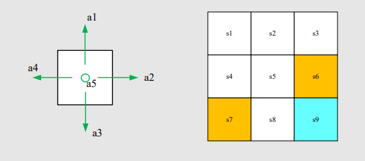

##
:book:Chapter 1 -Basic Concepts

###&emsp;:hand: State 
&emsp;&emsp;State space --A set of status of angent 
###&emsp;:hand: Action
&emsp;&emsp;Action space --Set of possible actions of angent 
$$A_{i} = f(S_{i})$$
$$S_{1} -a_{1}->S_{2} $$

###&emsp;:hand: State-Transition Probability

|          |      A1       |  A2   |
|------    |:-----------:  |------:|
| S1       |  S2          | S1    |
| S2       |  S1           |   S2  |

&emsp;&emsp;The Probbility is determined
$$P(S_{2}|S_{1},A_{1}) = 1$$ 
&emsp;&emsp;But things aren't always like that
###&emsp;:hand: Policy -"Path" or A set of Transition
####For Exapmle:

&emsp;For Policy $\Pi$ ,mathmetically:
$$P(Location(1,1)|TurnRight)=1$$
$$P(Location(1,1)|Other_actions)=0$$
$$...$$
&emsp;The "P" can be any value between 0  and 1 , on a common ground
$$\sum  P_{all} = 1$$
###&emsp;:hand: Reward --FeedBack in our System
&emsp;&emsp;&emsp;:warning:Reward depends on the "Current"status and action ,not the next state.
###&emsp;:hand: Trajectory and Return --"Path" and it's reward
&emsp;&emsp;Trajectory: 🐍 State-Action-Reward Chain
&emsp;&emsp;Return:     🐉∑ (Reward in the Track)
&emsp;&emsp;Discounted Return: 
$$Discounted Return = \sum Reward_{i}*DiscountRate^{i}(0<DR<1)$$
###&emsp;:hand: Episode --"Trial" & Terminal state
&emsp;&emsp;&emsp;Episode has a terminal State we have two ways to process it.
#####1. Absorb it --Set the terminal state a absorbing state.Whatever the angent take it will return to the ab state
#####2. Common ways --we treat the term state a common one,but give it big reward.Thus, the angent can try another ways to reach the terminal state.
##&emsp;:memo: Framework MDP (Markov-Decision-Process)
###&emsp;Sets:
&emsp;&emsp;&emsp; - State & Acthon & Reward
&emsp;&emsp;&emsp; - Probaility Distribution
&emsp;&emsp;&emsp; - Policy
&emsp;&emsp;&emsp;[Marcov-Chain](https://www.bilibili.com/video/BV1xa4y1w7aT/)
